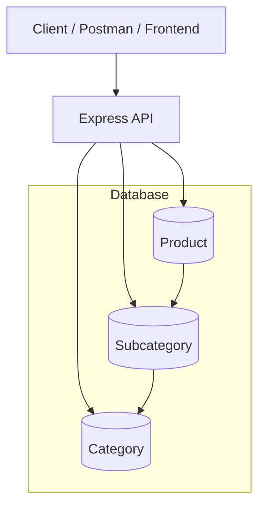

# 📦 Product Import & Management API

> A robust RESTful service built with **Node.js**, **Express**, and **MongoDB (Mongoose)** — designed to import, manage, filter, and query products from Excel at scale.

<p align="center">     

---

## 🚀 Overview

This project is a **RESTful backend service** that imports product data from Excel (.xlsx) into MongoDB and offers powerful querying, filtering, and pagination capabilities.

It is designed with **clean data modeling**, **duplicate prevention**, and **scalable query patterns** for real-world usage such as e-commerce platforms or large inventory systems.

Core Features:

- Excel-based data ingestion
- Duplicate prevention based on unique productCode
- Structured relationships:
  - Category → Subcategory → Product
- Advanced filtering
- Full-text multi-field search
- Pagination & sorting
- Date-based warranty analysis

## 🧩 Tech Stack

| Layer                | Technology              |
| -------------------- | ----------------------- |
| **Runtime**          | Node.js                 |
| **Framework**        | Express.js              |
| **ODM**              | Mongoose                |
| **Database**         | MongoDB                 |
| **File Parser**      | ExcelJS                 |
| **Validation**       | VineJS                  |
| **Containerization** | Docker + Docker Compose |
| **Logging**          | Winston / Console       |
| **Docs**             | Swagger                 |
| **Uploader**         | Multer                  |

## 📦 Installed Packages & Their Usage

This project uses the following core dependencies to support validation, security, file handling, database operations, documentation, and Excel processing:

1. **@vinejs/vine**:
   Used for **schema-based validation**, especially for validating environment variables and request payloads.

2. **express**:
   Core **web framework** used to build the REST API.

3. **helmet**:
   Used to improve **HTTP security** by setting secure response headers.

4. **cors**:
   Manages **cross-origin** requests for your API.

5. **express-rate-limit**:
   Protects the server from abuse by **limiting repeated requests** from the same IP.

6. **multer**:
   Handles **file uploads**, used mainly for importing Excel files..

7. **exceljs**:
   Used to **read and process Excel files.**

8. **moment-jalaali**:
   Handles **Jalali (Persian) dates** and converts them to UTC/ISO for MongoDB.

9. **mongoose**:
   ODM (Object Data Mapper) for **MongoDB.**

10. **swagger-jsdoc**:
    Generates Swagger/OpenAPI specification from **JSDoc comments.**

11. **swagger-ui-express**:
    Provides **Swagger UI** to visualize and test API routes.

---

## 🧱 Architecture Diagram



---

## 🧠 Design Highlights

- ✅ **Duplicate-safe import**  
  Uses productCode as a strict unique identifier
- 🧩 **Normalized data model**  
  Category → Subcategory → Product
- 🔍 **Multi-field search**  
  name, productCode, category, subcategory
- ⚡ **Optimized aggregation pipeline**
- 🧮 **Advanced filtering (AND-based)**
- 🗓️ **Warranty analysis (active / range filters)**
- 📄 **Detailed import report generation**

---

## 🧱 Project Structure

```pgsql
backend-task/
├── env/
│   ├── .env.example
│   ├── .env.development
│   ├── .env.production
├── src/
│   ├── common/
│   │   ├── constant
│   │   ├── middlewares
│   │   ├── utils
│   ├── config
│   ├── modules/
│   │   ├── category
│   │   └── product
│   │   └── index.js
│   ├── app.js
│   ├── main.js
├── .gitignore
├── package.json
├── pnpm-lock.yaml
├── pnpm-workspace.yaml
└── README.md

```

---

## 🧪 Sample .env

```env
PORT = 3000
CORS_ORIGIN = "*"
NODE_ENV = "development"
MONGODB_MIN_POOL_SIZE = 5
MONGODB_MAX_POOL_SIZE = 30
MULTER_MAX_FILE_SIZE = 10485760
MONGODB_READ_PREFERENCE = "primaryPreferred"
MONGODB_URI = mongodb://localhost:27017/products

```

## 🧰 Development Setup

```bash
# 1️⃣ Clone the repo
git clone https://github.com/SobhanHaghverdi/backend-task.git

# 2️⃣ Install dependencies
pnpm install

# 3️⃣ Set up environment
cp env/.env.example env/.env.development

# 4️⃣ Start development
pnpm run dev

```

---

## 🧰 Production Setup

```bash
# 1️⃣ Clone the repo
git clone https://github.com/SobhanHaghverdi/backend-task.git

# 2️⃣ Install dependencies
pnpm install

# 3️⃣ Set up environment
cp env/.env.example env/.env.production

# 4️⃣ Start production
pnpm run start

```

---

## 🌐 Live Demo

```md
Backend API:
https://backend-task-production-9e5d.up.railway.app/

Swagger:
https://backend-task-production-9e5d.up.railway.app/docs

Example Endpoint:

GET /docs.json (Access to generated definition by swagger)
GET /api/products
POST /api/products/import
```

---

## 🧪 Test Flow

```md
1. Download sample Excel (https://github.com/SobhanHaghverdi/backend-task/blob/develop/reports/test-import.xlsx)
2. Open Swagger `/products/import`
3. Upload the file
4. Check `/products`
```
