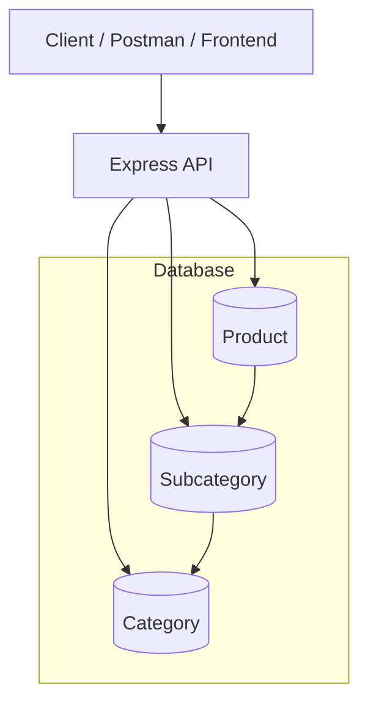

# 📦 Product Import & Management API

> A robust RESTful service built with **Node.js**, **Express**, and **MongoDB (Mongoose)** — designed to import, manage, filter, and query products from Excel at scale.

<p align="center">     

---

## 🚀 Overview

This project is a **RESTful backend service** that imports product data from Excel (.xlsx) into MongoDB and offers powerful querying, filtering, and pagination capabilities.

It is designed with **clean data modeling**, **duplicate prevention**, and **scalable query patterns** for real-world usage such as e-commerce platforms or large inventory systems.

Core Features:

- Excel-based data ingestion
- Duplicate prevention based on unique productCode
- Structured relationships:
  - Category → Subcategory → Product
- Advanced filtering
- Full-text multi-field search
- Pagination & sorting
- Date-based warranty analysis

## 🧩 Tech Stack

| Layer                | Technology              |
| -------------------- | ----------------------- |
| **Runtime**          | Node.js                 |
| **Framework**        | Express.js              |
| **ODM**              | Mongoose                |
| **Database**         | MongoDB                 |
| **File Parser**      | ExcelJS                 |
| **Validation**       | VineJS                  |
| **Containerization** | Docker + Docker Compose |
| **Logging**          | Winston / Console       |
| **Docs**             | Swagger                 |

---

## 🧱 Architecture Diagram



---

## 🧠 Design Highlights

- ✅ **Duplicate-safe import**  
  Uses productCode as a strict unique identifier
- 🧩 **Normalized data model**  
  Category → Subcategory → Product
- 🔍 **Multi-field search**  
  name, productCode, category, subcategory
- ⚡ **Optimized aggregation pipeline**
- 🧮 **Advanced filtering (AND-based)**
- 🗓️ **Warranty analysis (active / range filters)**
- 📄 **Detailed import report generation**

---

## 📦 Modules

---

## 🧱 Project Structure

---

## 🧰 Development Setup

```bash
# 1️⃣ Clone the repo
git clone https://github.com/SobhanHaghverdi/backend-task.git

# 2️⃣ Install dependencies
pnpm install

# 3️⃣ Set up environment
cp .env.example .env

# 4️⃣ Start development
pnpm run dev

```

---
